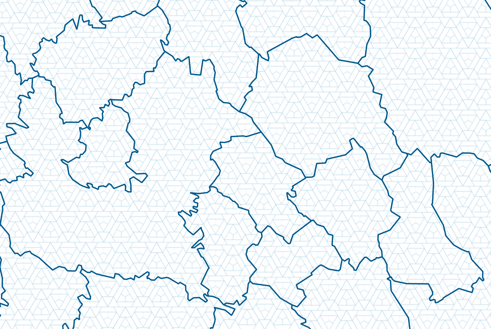

# QGIS Kumiko SVG

This repository contains the Kumiko patterns as SVGs into QGIS as SVG Fill. Go directly to the [*qgis-kumiko*](https://github.com/clronniema/qgis-kumiko-svg/tree/master/qgis-kumiko) directory to view all access the QGIS SVG Fill ready files.

## Inspiration

This idea is inspired by Wattenberger's [Kumiko generator](https://kumiko-generator.netlify.app/). To view the source code, please go to this [GitHub](https://github.com/Wattenberger/kumiko) repository. I believe she was inspired by this [video](https://www.youtube.com/watch?v=-NuqwJz9RNE&ab_channel=%E7%AB%B9%E4%B8%AD%E5%A4%A7%E5%B7%A5%E9%81%93%E5%85%B7%E9%A4%A8).

Some of the original Kumikos can be found in the [*kumiko*](https://github.com/clronniema/qgis-kumiko-svg/tree/master/kumiko) directory. Click on the images below to directly go to the raw content link.

## Changes I Have Made to the SVGs

The SVGs from Wattenberger are not directly usable for QGIS. The original images compose of a single tile of isocelese triangle, without filling up the whole rectangular SVG canvas. Therefore, I used the Python script *kumiko_to_square.py* to automatically complete the tessellation. 

Also, the fill settings are adjusted according to the [documentation](https://docs.qgis.org/3.16/en/docs/user_manual/style_library/symbol_selector.html#svg-marker). They are:

- fill=param(fill)
- stroke=param(outline)
- stroke-width=param(outline-width)

These attributes will allow QGIS to take control of the colors, and lines of the SVG polygon fills. A default value is also given, for viewing in the QGIS SVG browser panel.

## Example

You may find a sample style file (.xml) in the [*example*](https://github.com/clronniema/qgis-kumiko-svg/blob/master/example/finland_kumiko.qml) folder and try out the style. It should look something like this:

## Applying the SVGs

You may download the SVGs from this repository and register a folder for QGIS to search for SVGs. To do so, refer to this [QGIS Documentation](https://docs.qgis.org/3.16/en/docs/user_manual/introduction/qgis_configuration.html#svg-paths).

You may also go to one of the SVGs in this repository, then go to RAW to obtain a link like "https://raw.githubusercontent.com/clronniema/qgis-kumiko-svg/master/qgis-kumiko/f.svg". Use this link as your link to SVG. This is also the approach in the prepared style file example.

I have not figured how I could publish all the SVGs to QGIS Styles without generating dozens of new styles. Please let me know if you have any suggestions!

## Credits

- [@Wattenberger](https://github.com/Wattenberger) - for the awesome SVGs
- [@tjukanovt](https://github.com/tjukanovt) - for the awesome lecture during the ISSonVIS 2021 and advising 
